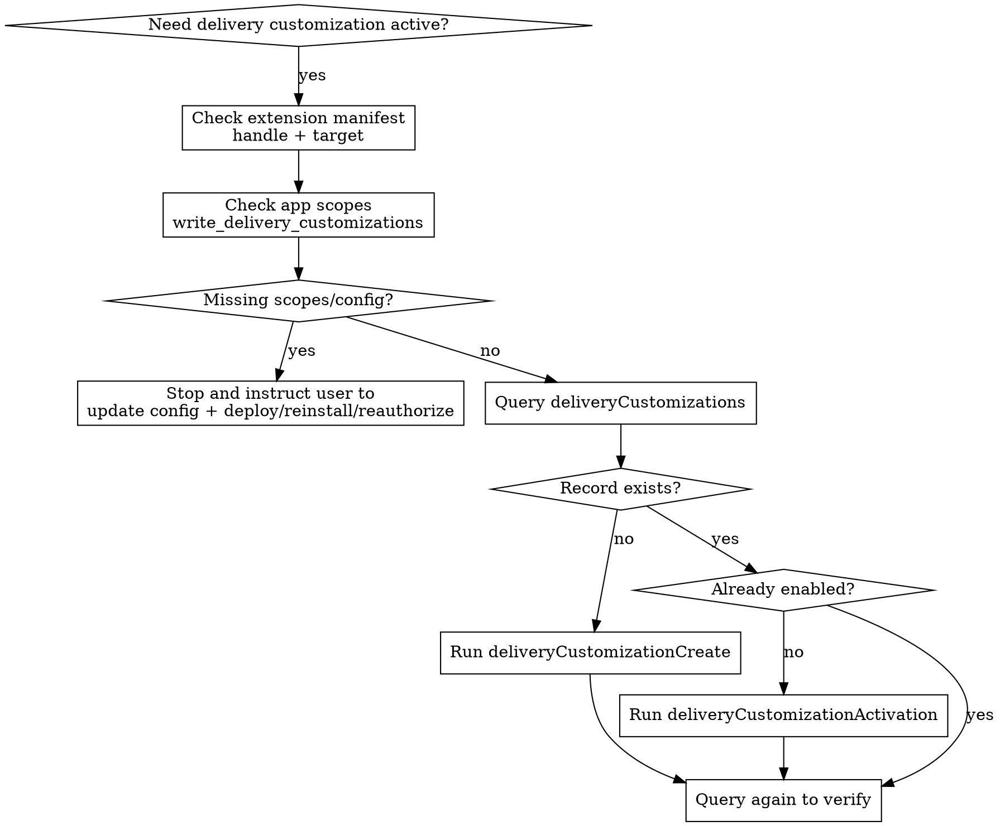

# Activating Shopify Delivery Customizations

## Overview

Use this skill to activate an already-built Shopify delivery customization safely.

Core principle: activation is an Admin/store workflow, not a deploy workflow. Do not deploy the app or function as part of this skill.

## When to Use

Use when:
- A user wants a Shopify delivery customization made active on a store
- A function already exists in the repo or app release and needs store-side activation
- You need to confirm scopes, reauthorization status, or delivery customization records
- You need the correct `shopify app execute` + Admin GraphQL workflow

Do not use when:
- The task is to build, change, or debug function logic
- The task is to deploy a Shopify app or function
- The task is to test storefront or checkout runtime behavior

## Hard Guardrails

Never do these in this skill:
- Run `shopify app deploy`
- Deploy the app or function by any other means
- Treat deploy as part of activation
- Perform runtime/storefront/checkout behavior testing
- Switch this workflow to `shopify store auth` or `shopify store execute`
- Verify deploy status as part of deciding whether activation can proceed
- Run build, dev, or function-run commands as part of activation

If required config or scopes are missing:
- Stop
- Tell the user exactly which config files or scopes need updating
- Tell the user they must deploy/reinstall/reauthorize before activation can continue
- Do not continue until they confirm that happened

## Workflow



## Step By Step

1. Confirm the extension is the right one.
Read `shopify.extension.toml` and verify:
- `handle` matches the function you intend to activate
- `target` is a delivery customization target such as `cart.delivery-options.transform.run`

2. Check app scopes before touching the store.
Inspect relevant `shopify.app*.toml` files for:
- `write_delivery_customizations`
- Usually also `read_delivery_customizations`

If missing, stop and tell the user exactly what to add. Also tell them local config changes are not enough; the app must be deployed/reinstalled/reauthorized before the store will grant the new scope.

Do not try to repair missing grants by using alternate CLI auth commands. If the store lacks the granted scope, stop and tell the user to reinstall or reauthorize the app.

3. Query current store state.
Use `shopify app execute` against the target store to list delivery customizations.

Use `shopify app execute` for store-side GraphQL in this workflow. Do not replace it with `shopify store execute`.

Example query:

```graphql
query DeliveryCustomizations {
  deliveryCustomizations(first: 50) {
    edges {
      node {
        id
        title
        enabled
        functionId
        shopifyFunction {
          id
          handle
          title
        }
      }
    }
  }
}
```

4. Create if no record exists for the target function handle.

Use `deliveryCustomizationCreate` with `functionHandle`, not guessed IDs.

```graphql
mutation CreateDeliveryCustomization($input: DeliveryCustomizationInput!) {
  deliveryCustomizationCreate(deliveryCustomization: $input) {
    deliveryCustomization {
      id
      title
      enabled
      functionId
      shopifyFunction {
        id
        handle
        title
      }
    }
    userErrors {
      field
      message
    }
  }
}
```

Example variables:

```json
{
  "input": {
    "functionHandle": "pickup-store-priority",
    "title": "pickup-store-priority",
    "enabled": true
  }
}
```

5. Activate if the record exists but is disabled.

```graphql
mutation ActivateDeliveryCustomization($ids: [ID!]!, $enabled: Boolean!) {
  deliveryCustomizationActivation(ids: $ids, enabled: $enabled) {
    userErrors {
      field
      message
    }
  }
}
```

6. Verify with a follow-up query.
Success in this skill means the Admin API shows the expected delivery customization record and `enabled: true`.

## Quick Reference

| Situation | Action |
| --- | --- |
| Missing `write_delivery_customizations` | Stop and tell user to update config, then deploy/reinstall/reauthorize |
| Local scopes updated but store still rejects mutation | Stop and tell user the app install has not been reauthorized yet |
| No delivery customization exists for the handle | Run `deliveryCustomizationCreate` |
| Delivery customization exists but `enabled` is `false` | Run `deliveryCustomizationActivation` |
| Mutation returns `userErrors` | Treat as the result; do not guess around it |
| User asks to "make it live" | Do not assume deploy is allowed or needed |
| You feel tempted to use `shopify store execute` or `shopify store auth` | Stay on `shopify app execute`; if scopes are missing, stop |

## Common Mistakes

- Confusing activation with deploy
- Running runtime or checkout tests even though the task is only activation
- Switching from `shopify app execute` to `shopify store execute` or `shopify store auth`
- Updating `shopify.app*.toml` and then continuing without waiting for reauthorization
- Using the wrong function handle
- Guessing GraphQL mutation names or input fields
- Assuming a successful deploy means the delivery customization is active on a store
- Checking deploy status and treating it as a gate for activation work

## Rationalizations To Reject

| Excuse | Reality |
| --- | --- |
| "I should deploy just to be safe" | Deploy is outside this skill. Activation only. |
| "I updated the scopes locally, so I can continue" | Local config is insufficient. The installed app must grant the scope. |
| "I should test checkout to prove it works" | Runtime validation is not part of this skill. Verify through Admin API only. |
| "I can probably use functionId in create" | Use documented delivery customization inputs, not guessed fields. |
| "The user said live everywhere, so I should push all environments" | Clarify store/environment scope first. |
| "I can work around scope issues with `shopify store auth`" | Missing grants are an app install problem. Stop and ask for reinstall or reauthorization. |
| "I should check whether the latest deploy happened first" | This skill assumes the function should already exist in an app release. Do not expand scope into deploy verification. |

## Red Flags

Stop if you catch yourself thinking:
- "Deploy is probably part of activation"
- "I already changed the scopes, I can keep going"
- "I should run a checkout test before I finish"
- "I can use `shopify store execute` instead"
- "I should verify deploy status first"
- "I can infer the mutation shape from memory"
- "The user said all, so I will modify every environment without confirmation"

All of these mean: stop, return to the workflow, and keep the task limited to store-side activation.

## Example Response Pattern

Use this structure when blocked on scopes:

1. State the exact missing scope or config issue.
2. Name the file or files that need updating.
3. Say the user must deploy/reinstall/reauthorize before activation can continue.
4. Stop.

Use this structure when activation succeeds:

1. State whether you created or activated the delivery customization.
2. Return the delivery customization id and enabled state.
3. Say verification was done with a follow-up Admin API query.
